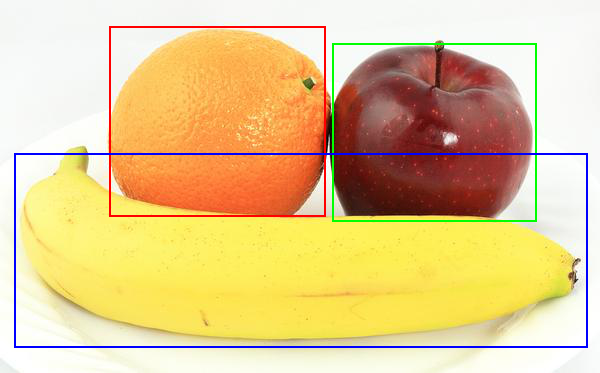

### TensorFlow Lite : label_image object detection on Raspberry Pi Zero W

This is a follow-on to compiling TensorFlow Lite for the Raspberry Pi Zero W as detailed at https://github.com/cloudwiser/TensorFlowLiteRPIZero

Having got the C++ `minimal` example code compiled, this extends the `label_image` example to demonstrate object detection and bounding box extraction using the SSD Mobilenet model trained against the COCO traning set

Copy the content in the `./example`, `./make` and `./bin` sub-directories of this repo to the equivalent paths in your local `./tensorflow/tensorflow/lite/...` directory structure (after backing up the original content)

Please note that `label_image` has not been tested with other quantized or non-quantized models and it expects 1 input tensor and 4 output tensors...so running it with other models may either fail this test and/or cause a runtime error during model load or invocation

If this does occur, it should be a case of adjusting the input and output tensor size checks and ensuring the correct handling of TfLite `float` or `uint8_t` output tensors

Once you have installed (and amended) the code, build it via...

```sh
$ cd ~/tensorflow/tensorflow/lite/tools/make/

$ ./build_rpi_armv6_label_image.sh
```

and then run `label_image` as follows. Note: the `-o 1` option writes the output image (with any above-threshold bounding boxes rendered) to an out file of the format `out_<input_filename>` 

```sh
$ cd ~/tensorflow/tensorflow/lite/tools/make/gen/rpi_armv6/bin

$ ./label_image -i fruit.bmp -m ./coco_ssd_mobilenet_v1_1.0_quant_2018_06_29/detect.tflite -l ./coco_ssd_mobilenet_v1_1.0_quant_2018_06_29/labelmap.txt -v 1

$ ./label_image -i orange_banana_apple.bmp -m ./coco_ssd_mobilenet_v1_1.0_quant_2018_06_29/detect.tflite -l ./coco_ssd_mobilenet_v1_1.0_quant_2018_06_29/labelmap.txt -o 1
```

Run `label_image` with `-h` and/or read the source code for the complete set of command line options

Note that this application is based heavily on the current TensorFlow Lite`label_image` example code. 
Please chek the master branch in the TensorFlow repo for any reelvant changes 


<p align="center">
  
</p>
